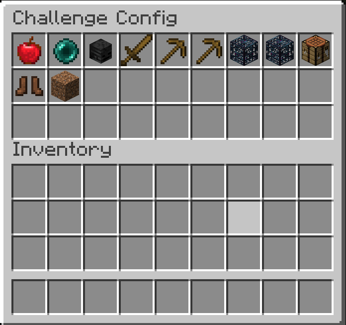
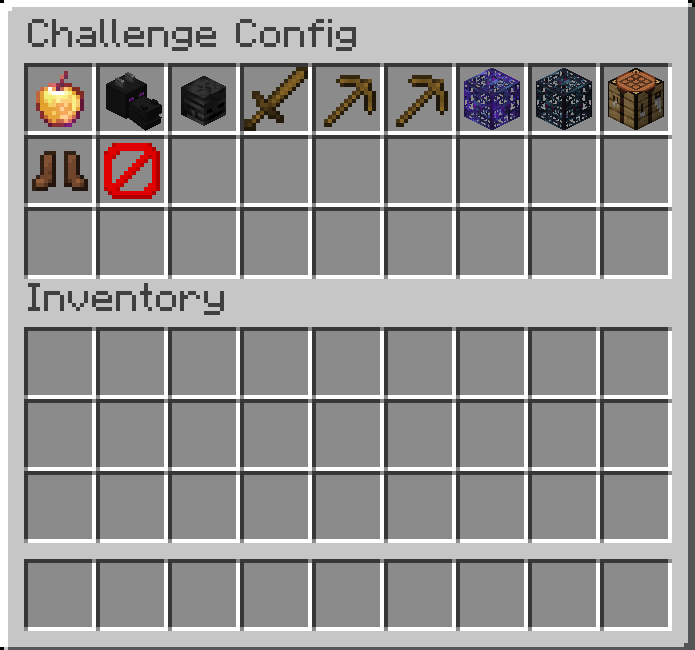

# Minecraft Challenges Mod

A mob that adds new challenges to minecraft.

# Installation

The mob is currently server side only. Download the packaged jar and install it in your servers mod folder.

# Usage

If the mod was loaded successfully, you will have the following commands available (assuming you are OP on the server):

| command             | Description                                   | Note                                                                                         |
|---------------------|-----------------------------------------------|----------------------------------------------------------------------------------------------|
| `/challenge config` | Configure which challenges should be active   | You can also configure an active challenge after it was started and (de-)activate challenges |
| `/challenge start`  | Starts the challenge and the associated timer | Make sure to configure the challenges before!                                                |
| `/challenge pause`  | Pause the timer of the challenge              |                                                                                              |
| `/challenge resume` | Resume the timer of the challenge             |                                                                                              |
| `/challenge stop`   | Stop a running challenge                      |                                                                                              |

| Challenge configuration interface with no challenges active | Challenge configuration interface with Hardcore, Slay Enderdragon, Scrambled Mob Drops and Destroy Blocks on Break enabled |
| --- | --- |
|  |  | 

# Challenges

| Challenge                | Description                                                                                                                                                                                                                                                  | End Condition                                   |
|--------------------------|--------------------------------------------------------------------------------------------------------------------------------------------------------------------------------------------------------------------------------------------------------------|-------------------------------------------------|
| Hardcore                 | Similar to vanilla hardcore, only that if one player dies, all other player also die and the challenge is lost.                                                                                                                                              | Loose: Death of at least one player             |
| Slay Enderdragon         | Challenge goal to finish minecraft (i.e. slay the Enderdragon).                                                                                                                                                                                              | Win: A player kills the ender dragon in the end |
| Slay Wither              | Challenge goal to kill the Wither.                                                                                                                                                                                                                           | Win: A player kills the wither                  |
| Scrambled Mob Drops      | If a mob is killed by a player, the mob drops a random item.  If the same player kills the same mob, they will always drop the same item (e.g. a cow killed by player x will always drop dirt, while a cow killed by player y will always drop cobblestone). | /                                               |
| Scrambled Block Drops    | If a player mines a block, the drops are scrambled on a per player and block basis.                                                                                                                                                                          | /                                               |
| Random Block Drops       | If a player mines a block, the drops are randomized.                                                                                                                                                                                                         | /                                               |
| Random Mobs on Damage    | If a player damages a mob, the mob will be replaced by a random other mob.                                                                                                                                                                                   | /                                               |
| Scrambled Mobs on Damage | If a player damages a mob, the mob will be replaced by a scrambled other mob.                                                                                                                                                                                | /                                               |
| No Crafting Tables       | Players cannot use crafting tables.                                                                                                                                                                                                                          | /                                               |
| Random Mob Speed         | Newly spawned mobs will spawn with a random speed modifier, which can make them slower or faster then they normally would be.                                                                                                                                | /                                               |
| Delete Block on Break    | If a player breaks a block, a 3x3 matrix around that block will also be broken, but no items are dropped.                                                                                                                                                    | /                                               |

## A Note on Randomizers and Scramblers

* *Randomizer*: A randomizer always select a random item/block/mob for every player. E.g. if player x first hits a cow, it is replaced by a chicken. If player x hits a second cow it is replaced by a zombie.
* *Scrambler*: A scrambler will pre-randomize all items/blocks/mobs for each player and then deterministically select the same item/block/mob for each input element. E.g. if player x hits a cow, the cow will always be replaced by a chicken, while if player y hits a cow, the cow will always be replaced by a wither.

